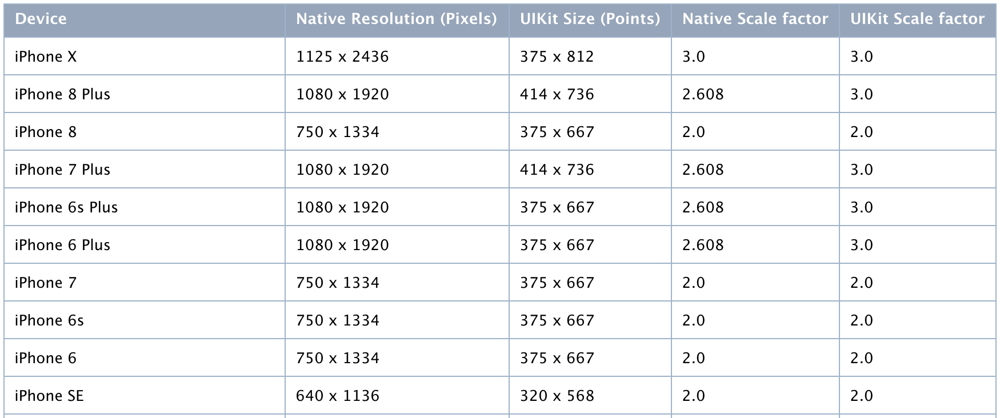

# python-wda
[](https://travis-ci.org/openatx/facebook-wda)
[](https://pypi.python.org/pypi/facebook-wda)
[]()

Facebook WebDriverAgent Python Client Library (not official)
Implemented apis describe in <https://github.com/facebook/WebDriverAgent/wiki/Queries>

Most functions finished.

Since facebook/WebDriverAgent has been archived. Recommend use the forked WDA: https://github.com/appium/WebDriverAgent

Tested with: <https://github.com/appium/WebDriverAgent/tree/v2.16.1>

## Alternatives
- gwda (Golang): https://github.com/ElectricBubble/gwda

## Installation
1. You need to start WebDriverAgent by yourself

	**New** There is a new tool, which can start WDA without xcodebuild, even you can run in Linux and Windows.
	See: <https://github.com/alibaba/tidevice>

	Or

	Follow the instructions in <https://github.com/appium/WebDriverAgent>

	It is better to start with Xcode to prevent CodeSign issues.

	But it is also ok to start WDA with command line.

	```
	xcodebuild -project WebDriverAgent.xcodeproj -scheme WebDriverAgentRunner -destination 'platform=iOS Simulator,name=iPhone 6' test
	```

	WDA在真机上运行需要一些配置，可以参考这篇文章 [ATX 文档 - iOS 真机如何安装 WebDriverAgent](https://testerhome.com/topics/7220)

	配置完之后运行下面的命令即可（需要用到Mac的密码，以及设备的UDID）
	
	```bash
	# 解锁keychain，以便可以正常的签名应用
	security unlock-keychain -p $your-mac-password-here ~/Library/Keychains/login.keychain

	# 获取设备的UDID
	UDID=$(idevice_id -l | head -n1)

	# 运行测试
	xcodebuild -project WebDriverAgent.xcodeproj -scheme WebDriverAgentRunner -destination "id=$UDID" test
	```

2. Install python wda client

	```
	pip install -U facebook-wda-plus
	```

## TCP connection over USB (optional)
You can use wifi network, it is very convinient, but not very stable enough.

I found a tools named `iproxy` which can forward device port to localhost, it\'s source code is here <https://github.com/libimobiledevice/libusbmuxd>

The usage is very simple `iproxy <local port> <remote port> [udid]`

For more information see [SSH Over USB](https://iphonedevwiki.net/index.php/SSH_Over_USB)

## Something you need to know
function `window_size()` return UIKit size, While `screenshot()` image size is Native Resolution 

[](https://developer.apple.com/library/archive/documentation/DeviceInformation/Reference/iOSDeviceCompatibility/Displays/Displays.html)

when use `screenshot`, the image size is pixels size. eg(`1080 x 1920`)
But this size is different with `c.window_size()`

use `session.scale` to get UIKit scale factor

## Configuration

```python

import wdap

wdap.DEBUG = False  # default False
wdap.HTTP_TIMEOUT = 60.0  # default 60.0 seconds
```

## How to use
### Create a client

```py

import wdap

# Enable debug will see http Request and Response
# wdap.DEBUG = True
c = wdap.Client('http://localhost:8100')

# get env from $DEVICE_URL if no arguments pass to wdap.Client
# http://localhost:8100 is the default value if $DEVICE_URL is empty
c = wdap.Client()
```

A `wda.WDAError` will be raised if communite with WDA went wrong.

**Experiment feature**: create through usbmuxd without `iproxy`

> Added in version: 0.9.0

class `USBClient` inherit from `Client`

USBClient connect to wda-server through `unix:/var/run/usbmuxd`

```python

import wdap

# 如果只有一个设备也可以简写为
# If there is only one iPhone connecttd
c = wdap.USBClient()

# 支持指定设备的udid，和WDA的端口号
# Specify udid and WDA port
c = wdap.USBClient("539c5fffb18f2be0bf7f771d68f7c327fb68d2d9", port=8100)

# 也支持通过DEVICE_URL访问
c = wdap.Client("usbmux://{udid}:8100".format(udid="539c5fffb18f2be0bf7f771d68f7c327fb68d2d9"))
print(c.window_size())

# 注:
# 仅在安装了tins的电脑上可以使用（目前并不对外开放)
# 1.2.0 引入 wda_bundle_id 参数
c = wdap.USBClient("539c5fffb18f2be0bf7f771d68f7c327fb68d2d9", port=8100, wda_bundle_id="com.facebook.custom.xctest")
```

看到这里，可以看 [examples](examples) 目录下的一些代码了 

### Client

```py
# Show status
print c.status()

# Wait WDA ready
c.wait_ready(timeout=300) # 等待300s，默认120s
c.wait_ready(timeout=300, noprint=True) # 安静的等待，无进度输出

# Press home button
c.home()

# Hit healthcheck
c.healthcheck()

# Get page source
c.source() # format XML
c.source(accessible=True) # default false, format JSON

c.locked() # true of false
c.lock() # lock screen
c.unlock() # unlock
c.app_current() # {"pid": 1281, "bundleId": "com.netease.cloudmusic"}

# OpenURL not working very well
c.open_url("taobao://m.taobao.com/index.htm")
```

Take screenshot save as png

```py
c.screenshot('screen.png') # Good
c.screenshot("screen.jpg") # Bad

# convert to PIL.Image and then save as jpg
c.screenshot().save("screen.jpg") # Good

c.appium_settings() # 获取appium的配置
c.appium_settings({"mjpegServerFramerate": 20}) # 修改配置
```

### Session
> From version 0.7.0, All Session methods moved to Client class. now Session is alias of Client

Open app

```py
with c.session('com.apple.Health') as s:
	print(s.orientation)
```

Same as

```py
s = c.session('com.apple.Health')
print(s.orientation)
s.close()
```

For web browser like Safari you can define page whit which will be opened:
```python
s = c.session('com.apple.mobilesafari', ['-u', 'https://www.google.com/ncr'])
print(s.orientation)
s.close()
```

Other app operation (Works in [appium/WebDriverAgent](https://github.com/appium/WebDriverAgent))

```bash
c.app_current() # show current app info
# Output example --
# {'processArguments': {'env': {}, 'args': []},
# 'name': '',
# 'pid': 2978,
# 'bundleId': 'com.apple.Preferences'}

# Handle alert automatically in WDA (never tested before)
# alert_action should be one of ["accept", "dismiss"]
s = c.session("com.apple.Health", alert_action="accept")

# launch without terminate app (WDAEmptyResponseError might raise)
c.session().app_activate("com.apple.Health") # same as app_launch

# terminate app
c.session().app_terminate("com.apple.Health")

# get app state
c.session().app_state("com.apple.Health")
# output {"value": 4, "sessionId": "xxxxxx"}
# different value means 1: die, 2: background, 4: running
```

### Session operations
```python
# set default element search timeout 30 seconds
s.implicitly_wait(30.0)

# Current bundleId and sessionId
print(s.bundle_id, s.id)

s.home() # same as c.home(), use the same API

s.lock() # lock screen
s.unlock() # unlock screen
s.locked() # locked status, true or false

s.battery_info() # return like {"level": 1, "state": 2}
s.device_info() # return like {"currentLocale": "zh_CN", "timeZone": "Asia/Shanghai"}

s.siri_activate("How's the weather today") #activate siri

# update clipboard
text = "Hello world"
s.siri_activate("open WebDriverAgentRunner-Runner")
import time
time.sleep(3)
s.set_clipboard(text)

# get clipboard
copyed = s.get_clipboard()

print(f"text == copyed: {text == copyed}")

# Screenshot return PIL.Image
# Requires pillow, installed by "pip install pillow"
s.screenshot().save("s.png")

# Sometimes screenshot rotation is wrong, but we can rotate it to the right direction
# Refs: https://pillow.readthedocs.io/en/3.1.x/reference/Image.html#PIL.Image.Image.transpose
from PIL import Image
s.screenshot().transpose(Image.ROTATE_90).save("correct.png")

# One of <PORTRAIT | LANDSCAPE>
print(s.orientation) # expect PORTRAIT or LANDSCAPE

# Change orientation
s.orientation = wda.LANDSCAPE # there are many other directions

# Deactivate App for some time
s.deactivate(5.0) # 5s

# Get width and height
print(s.window_size())
# Expect tuple output (width, height)
# For example: (414, 736)

# Get UIKit scale factor, the first time will take about 1s, next time use cached value
print(s.scale)
# Example output: 3

# Simulate touch
s.tap(200, 200)

# Very like tap, but support float and int argument
# float indicate percent. eg 0.5 means 50%
s.click(200, 200)
s.click(0.5, 0.5) # click center of screen
s.click(0.5, 200) # click center of x, and y(200)

# Double touch
s.double_tap(200, 200)

# Simulate swipe, utilizing drag api
s.swipe(x1, y1, x2, y2, 0.5) # 0.5s
s.swipe(0.5, 0.5, 0.5, 1.0)  # swipe middle to bottom

s.swipe_left()
s.swipe_right()
s.swipe_up()
s.swipe_down()

# tap hold for 1 seconds
s.tap_hold(x, y, 1.0)

# Hide keyboard (not working in simulator), did not success using latest WDA
# s.keyboard_dismiss()

# press home, volumeUp, volumeDown
s.press("home") # fater then s.home()
s.press("volumeUp")
s.press("volumeDown")

# New in WebDriverAgent(3.8.0)
# long press home, volumeUp, volumeDown, power, snapshot(power+home)
s.press_duration("volumeUp", 1) # long press for 1 second
s.press_duration("snapshot", 0.1)

# 单个手指多点滑动轨迹方法实例
s.touch_action().add_pointer(
    pointer_id="finger1",
    actions=[
        ("move", 200, 300, 0),    # 移动到起点
        ("down",),                 # 按下
        ("pause", 1000),           # 长按1秒
        ("move", 400, 500, 500),   # 拖动到终点（500ms）
        ("up",)                    # 抬起
    ]
).perform()
# 1. 单指从(500,300)滑动到(100,300)（500ms）：
s.touch_action().add_pointer(
   pointer_id="finger1",
   actions=[
	   ("move", 500, 300, 0),  # 0ms 移动到起点
	   ("down",),               # 按下
	   ("move", 100, 300, 500), # 500ms 移动到终点
	   ("up",)                  # 抬起
   ]
).perform()

# 2. 双指缩放（从中心向外扩大）：
s.touch_action().add_pointer(
   pointer_id="finger1",
   actions=[("move", 200, 300, 0), ("down",), ("move", 100, 300, 1000), ("up",)]
).add_pointer(
   pointer_id="finger2",
   actions=[("move", 300, 300, 0), ("down",), ("move", 400, 300, 1000), ("up",)]
).perform()
```

### Find element
> Note: if element not found, `WDAElementNotFoundError` will be raised

```python
# For example, expect: True or False
# using id to find element and check if exists
s(id="URL").exists # return True or False

# using id or other query conditions
s(id='URL')

# using className
s(className="Button")

# using name
s(name='URL')
s(nameContains='UR')
s(nameMatches=".RL")

# using label
s(label="label")
s(labelContains="URL")

# using value
s(value="Enter")
s(valueContains="RL")

# using  visible, enabled
s(visible=True, enabled=True)

# using index, index must combined with at least on label,value, etc...
s(name='URL', index=1) # find the second element. index of founded elements, min is 0

# combines search conditions
# attributes bellow can combines
# :"className", "name", "label", "visible", "enabled"
s(className='Button', name='URL', visible=True, labelContains="Addr")
```

More powerful finding method

```python
s(xpath='//Button[@name="URL"]')

# another code style
s.xpath('//Button[@name="URL"]')

s(predicate='name LIKE "UR*"')
s('name LIKE "U*L"') # predicate is the first argument, without predicate= is ok
s(classChain='**/Button[`name == "URL"`]')
```

To see more `Class Chain Queries` examples, view <https://github.com/facebookarchive/WebDriverAgent/wiki/Class-Chain-Queries-Construction-Rules>

[Predicate Format String Syntax](https://developer.apple.com/library/archive/documentation/Cocoa/Conceptual/Predicates/Articles/pSyntax.html)

### Get Element info
```python
# if not found, raise WDAElementNotFoundError
e = s(text='Dashboard').get(timeout=10.0)

# e could be None if not exists
e = s(text='Dashboard').wait(timeout=10.0)

# get element attributes
e.className # XCUIElementTypeStaticText
e.name # XCUIElementTypeStaticText  /name
e.visible # True    /attribute/visible
e.value # Dashboard /attribute/value
e.label # Dashboard /attribute/label
e.text # Dashboard  /text
e.enabled # True    /enabled
e.displayed # True  /displayed

e.bounds # Rect(x=161, y=32, width=53, height=21)  /rect
x, y, w, h = e.bounds


```

### Element operations (eg: `tap`, `scroll`, `set_text` etc...)
Exmaple search element and tap

```python
# Get first match Element object
# The function get() is very important.
# when elements founded in 10 seconds(:default:), Element object returns
# or WDAElementNotFoundError raises
e = s(text='Dashboard').get(timeout=10.0)
# s(text='Dashboard') is Selector
# e is Element object
e.tap() # tap element
```

>Some times, I just hate to type `.get()`

Using python magic tricks to do it again.

```python
# 	using python magic function "__getattr__", it is ok with out type "get()"
s(text='Dashboard').tap()
# same as
s(text='Dashboard').get().tap()
```

Note: Python magic tricks can not used on get attributes

```python
# Accessing attrbutes, you have to use get()
s(text='Dashboard').get().value

# Not right
# s(text='Dashboard').value # Bad, always return None
```

Click element if exists

```python
s(text='Dashboard').click_exists() # return immediately if not found
s(text='Dashboard').click_exists(timeout=5.0) # wait for 5s
```

Other Element operations

```python
# Check if elements exists
print(s(text="Dashboard").exists)

# Find all matches elements, return Array of Element object
s(text='Dashboard').find_elements()

# Use index to find second element
s(text='Dashboard')[1].exists

# Use child to search sub elements
s(text='Dashboard').child(className='Cell').exists

# Default timeout is 10 seconds
# But you can change by
s.set_timeout(10.0)

# do element operations
e.tap()
e.click() # alias of tap
e.clear_text()
e.set_text("Hello world")
e.tap_hold(2.0) # tapAndHold for 2.0s

e.scroll() # scroll to make element visiable

# directions can be "up", "down", "left", "right"
# swipe distance default to its height or width according to the direction
e.scroll('up')

# Set text
e.set_text("Hello WDA") # normal usage
e.set_text("Hello WDA\n") # send text with enter
e.set_text("\b\b\b") # delete 3 chars

# Wait element gone
s(text='Dashboard').wait_gone(timeout=10.0)

# Swipe
s(className="Image").swipe("left")

# Pinch
s(className="Map").pinch(2, 1) # scale=2, speed=1
s(className="Map").pinch(0.1, -1) # scale=0.1, speed=-1 (I donot very understand too)

# properties (bool)
e.accessible
e.displayed
e.enabled

# properties (str)
e.text # ex: Dashboard
e.className # ex: XCUIElementTypeStaticText
e.value # ex: github.com

# Bounds return namedtuple
rect = e.bounds # ex: Rect(x=144, y=28, width=88.0, height=27.0)
rect.x # expect 144
```

Alert

```python
print(s.alert.exists)
print(s.alert.text)
s.alert.accept() # Actually do click first alert button
s.alert.dismiss() # Actually do click second alert button
s.alert.wait(5) # if alert apper in 5 second it will return True,else return False (default 20.0)
s.alert.wait() # wait alert apper in 2 second

s.alert.buttons()
# example return: ["设置", "好"]

s.alert.click("设置")
s.alert.click(["设置", "信任", "安装"]) # when Arg type is list, click the first match, raise ValueError if no match
```

Alert monitor

```python
with c.alert.watch_and_click(['好', '确定']):
	s(label="Settings").click() # 
	# ... other operations

# default watch buttons are
# ["使用App时允许", "好", "稍后", "稍后提醒", "确定", "允许", "以后"]
with c.alert.watch_and_click(interval=2.0): # default check every 2.0s
	# ... operations
```

### Callback
回调操作: `register_callback`

```python
c = wda.Client()

# 使用Example
def device_offline_callback(client, err):
	if isinstance(err, wda.WDABadGateway):
		print("Handle device offline")
		ok = client.wait_ready(60) # 等待60s恢复
		if not ok:
			return wda.Callback.RET_ABORT
		return wda.Callback.RET_RETRY

c.register_callback(wda.Callback.ERROR, device_offline_callback, try_first=True)
# try_first 优先使用device_offline_callback函数处理ERROR


# the argument name in callback function can be one of
# - client: wdap.Client
# - url: str, eg: http://localhost:8100/session/024A4577-2105-4E0C-9623-D683CDF9707E/wda/keys
# - urlpath: str, eg: /wdap/keys  (without session id)
# - with_session: bool # if url contains session id
# - method: str, eg: GET
# - response: dict # Callback.HTTP_REQUEST_AFTER only 
# - err: WDAError # Callback.ERROR only
#
def _cb(client: wda.Client, url: str):
	if url.endswith("/wdap/keys"):
		print("send_keys called")

c.register_callback(wda.Callback.HTTP_REQUEST_BEFORE, _cb)
c.register_callback(wda.Callback.HTTP_REQUEST_BEFORE, lambda url: print(url), try_first=True) # 回调会比_cb更先回调
c.send_keys("Hello")

# unregister
c.unregister_callback(wda.Callback.HTTP_REQUEST_BEFORE, _cb)
c.unregister_callback(wda.Callback.HTTP_REQUEST_BEFORE) # ungister all
c.unregister_callback() # unregister all callbacks
```

支持的回调有

```
wda.Callback.HTTP_REQUEST_BEFORE
wda.Callback.HTTP_REQUEST_AFTER
wda.Callback.ERROR
```

默认代码内置了两个回调函数 `wda.Callback.ERROR`，使用`c.unregister_callback(wda.Callback.ERROR)`可以去掉这两个回调

- 当遇到`invalid session id`错误时，更新session id并重试
- 当遇到设备掉线时，等待`wda.DEVICE_WAIT_TIMEOUT`时间 (当前是30s，以后可能会改的更长一些)

## TODO
longTap not done pinch(not found in WDA)

TouchID

* Match Touch ID
* Do not match Touch ID

## How to handle alert message automaticly (need more tests)
For example

```python

import wdap

s = wdap.Client().session()


def _alert_callback(session):
	session.alert.accept()


s.set_alert_callback(_alert_callback)  # deprecated，此方法不能用了

# do operations, when alert popup, it will auto accept
s(type="Button").click()
```

## Special property
```python
# s: wdap.Session
s.alibaba.xxx  # only used in alibaba-company
```

## DEVELOP
See [DEVELOP.md](DEVELOP.md) for more details.

## iOS Build-in Apps
**苹果自带应用**

|   Name | Bundle ID          |
|--------|--------------------|
| iMovie | com.apple.iMovie |
| Apple Store | com.apple.AppStore |
| Weather | com.apple.weather |
| 相机Camera | com.apple.camera |
| iBooks | com.apple.iBooks |
| Health | com.apple.Health |
| Settings | com.apple.Preferences |
| Watch | com.apple.Bridge |
| Maps | com.apple.Maps |
| Game Center | com.apple.gamecenter |
| Wallet | com.apple.Passbook |
| 电话 | com.apple.mobilephone |
| 备忘录 | com.apple.mobilenotes |
| 指南针 | com.apple.compass |
| 浏览器 | com.apple.mobilesafari |
| 日历 | com.apple.mobilecal |
| 信息 | com.apple.MobileSMS |
| 时钟 | com.apple.mobiletimer |
| 照片 | com.apple.mobileslideshow |
| 提醒事项 | com.apple.reminders |
| Desktop | com.apple.springboard (Start this will cause your iPhone reboot) |

**第三方应用 Thirdparty**

|   Name | Bundle ID          |
|--------|--------------------|
| 腾讯QQ | com.tencent.mqq |
| 微信 | com.tencent.xin |
| 部落冲突 | com.supercell.magic |
| 钉钉 | com.laiwang.DingTalk |
| Skype | com.skype.tomskype |
| Chrome | com.google.chrome.ios |


Another way to list apps installed on you phone is use `ideviceinstaller`
install with `brew install ideviceinstaller`

List apps with command

```sh
$ ideviceinstaller -l
```

## Tests
测试的用例放在`tests/`目录下，使用iphone SE作为测试机型，系统语言应用。调度框架`pytest`

## WDA Benchmark E2E Tests
[E2E Tests](e2e_benchmarks)
Latest WDA Version Testing Report:
- [WDA Version 7.1.1](e2e_benchmarks/reports/WDA_V711.md)
- [WDA Version 6.1.1](e2e_benchmarks/reports/WDA_V611.md)

## 图像与文字识别（CV / Vision）`client.cv`
> 需要服务端 WDA 为带 OpenCV + Vision 的分支（如 `wda_cv_vision`），接口定义见
> `WebDriverAgentLib/Commands/FBVisionCommands.m`。9 个端点全部已封装。

```python
import wdap
c = wdap.USBClient()          # 或 wdap.Client()

# 0) 能力探测：判断当前 WDA 包是否带 OpenCV（不需要 session）
status = c.cv.status()
print(status.cv_available, status.vision_available, status.opencv_version, status.scale)

# 1) 取原始分辨率截图（做模板图用）
c.cv.snapshot("screen.png")                  # 存文件
data = c.cv.snapshot(max_width=400)          # 拿二进制，可按比例缩小

# 2) OCR：识别整屏文字
for item in c.cv.ocr(languages=["zh-Hans", "en-US"]):
    print(item.text, item.confidence, item.center)   # center 是逻辑点，可直接点击

# 3) 找字并点击（contains / exact / regex 三种模式）
c.cv.find_text("登录", tap=True)
c.cv.tap_text("登录")                        # 等价简写，返回是否真的点了

# 4) 等待文字出现（timeout / interval 单位毫秒，timeout 上限 60000）
ret = c.cv.wait_for_text("加载完成", timeout=10000, interval=500)
if ret:                                     # 未命中不报错，用 found 判断
    print("等到了", ret.first.center, "耗时 ms:", ret.waited)

# 5) 找图并点击（template 支持 文件路径 / bytes / base64 / PIL.Image）
ret = c.cv.match_image("tpl.png", threshold=0.85, tap=True)
ret = c.cv.match_image("tpl.png", scale_min=0.8, scale_max=1.2,
                       scale_steps=5, region=(0, 0, 1170, 1200))   # 多尺度 + 限定区域

# 6) 等待图片出现
c.cv.wait_for_image("tpl.png", timeout=15000, tap=True)

# 7) 找色（color 支持 "#RRGGBB" / "#RGB" / [r, g, b]）
c.cv.find_color("#FF5522", color_space="hsv", tolerance=12, tap=True)

# 8) 等待颜色出现
c.cv.wait_for_color([255, 85, 34], timeout=8000)
```

返回值统一是 `CVResult`：

| 属性 / 方法 | 说明 |
| --- | --- |
| `found` / `count` | 是否命中 / 命中数量（支持 `if ret:`、`len(ret)`） |
| `results` / `ret[0]` / `for x in ret` | 命中列表，元素为 `CVMatch` |
| `first` / `tapped_item` | 第一条结果 / 被点击的那一条 |
| `item.x` / `item.y` | **逻辑点**坐标，可直接用于 `c.click(x, y)` |
| `item.pixel_x` / `item.pixel_y` / `item.rect` | 截图像素坐标与矩形 |
| `item.text` / `item.confidence` / `item.char_boxes` | 文字结果专有 |
| `item.score` / `item.matched_scale` | 找图/找色结果专有（`matched_scale` 为命中时模板缩放比） |
| `scale` / `image_size` / `waited` / `tapped` | 像素比 / 截图尺寸 / 实际等待毫秒 / 是否点了 |
| `save_debug_image(path)` | 保存 `debug=True` 时的标注图 |

> 坐标系：截图与 `region` / `rect` 都是**设备原始像素**，`x` / `y` 是**逻辑点**，`scale` 为两者比值。
> `find_text` / `match_image` / `find_color` 及对应的 `wait*` 支持通用参数：
> `region`、`index`、`tap`、`duration`(ms)、`taps`、`debug`；`wait*` 另加 `timeout`(ms，上限 60000)、`interval`(ms，上限 5000)。
> 未命中 / 等待超时都返回 HTTP 200，用 `found` 判断。

**注意：`ocr()` 是例外**，它只做全量识别、不过通用的点击逻辑，因此**没有**
`index` / `tap` / `duration` / `taps` 参数——要"找到文字并点击"请用 `find_text()`。

几个服务端会静默吞掉的错误，客户端已在本地拦截并抛异常：

| 写法 | 服务端真实行为 | 客户端处理 |
| --- | --- | --- |
| `mode="fuzzy"` / `method="orb"` / `color_space="lab"` | 静默退回默认值 | 抛 `ValueError`，只允许合法枚举 |
| `snapshot(format="jpg")` | 只认 `"jpeg"`，写 `jpg` 会静默变 png | 自动归一化 `jpg`→`jpeg` |
| `region={"x":0,"y":0,"width":0,...}` | 直接报错（不会退化成整屏） | 提前抛 `ValueError`，要求宽高为正 |
| `taps=9` | clamp 到 1..3 | 抛 `ValueError` |
| `timeout=70000` | clamp 到 60000ms | 抛 `ValueError` |

## 运行日志（`/wda/log/*`）`client.log`

WDA **自己的**运行日志：HTTP 请求 / 逃逸的异常 / MJPEG 异常 / 监听器重建 /
stderr 输出 / 上一次会话的崩溃报告。用来回答"端口还在但没反应""跑一小时整个 WDA
掉了"这类事后看不见的问题。需要设备上的 WDA 用带 `/wda/log/*` 的源码编译。

这些路由是 **session-less + standalone** 的：不需要 session，而且绕开共享路由队列——
所以即使 WDA 主线程/队列卡死，也仍然问得到，这正是排查卡死时该用的通道。

```python
import wdap
c = wdap.USBClient()

c.log.available()                            # 这台设备的 WDA 支不支持
c.log.stats().http["requests"]               # 计数器总览
c.log.stats().listener_restarts              # 监听器被重建过几次

snap = c.log.recent(limit=100, level="warn") # 最近 100 条 warn 以上
for e in snap.entries:
    print(e.format())

c.log.errors(category=wdap.LogCategory.EXCEPTION)  # 只看异常
c.log.crash(clear=True).report               # 上次进程是怎么死的
c.log.save("wda.log", limit=5000)            # 纯文本落盘
c.log.config(capacity=5000, stderr_capture=True)
c.log.clear()                                # 清空条目（计数器与 seq 不重置）
```

增量跟随（`Ctrl-C` / `break` 退出）：

```python
for entry in c.log.follow(interval=1.0, level="warn"):
    print(entry.format())
```

| 参数 | 说明 |
| --- | --- |
| `limit` | 1..20000（`recent`/`errors` 默认 200，`download` 默认 20000），超出服务端会 clamp |
| `level` | `debug` / `info` / `warn` / `error` / `fatal`；**写错会被服务端静默当成 `info`**，客户端直接抛 `ValueError` |
| `category` | `http` / `exception` / `mjpeg` / `socket` / `stderr` / `crash` / `lifecycle`，也接受任意自定义字符串 |
| `since` | 只取 `seq >= since` 的条目，`follow()` 内部用它做增量 |

⚠️ 一个容易踩的坑：这些 GET 端点的参数**不能拼在 URL 上**
（`/wda/log/recent?limit=10` 无效）——服务端构造 `request.arguments` 时只解析
**JSON body**。客户端已把关键字参数塞进 body，直接用即可。

路由不存在时（设备上不是带日志支持的 WDA）抛 `LogUnsupportedError`，
或先用 `c.log.available()` 探一次。

## 设备激活（仅 USB）

对标 go-ios 的 `ios activate`：走 `lockdown` + `com.apple.mobileactivationd` 完成设备激活。
纯标准库实现（plist + ssl + urllib），**不嵌入 go-ios / tidevice**，可以安全打进 ipa。

```python
import wdap

wdap.list_usb_devices()              # ['00008030-000D65402EF8202E', ...]
wdap.activation_state(udid)          # 'Activated' / 'Unactivated' / None
wdap.is_device_activated(udid)       # True / False

result = wdap.activate_device(udid)  # 已激活则直接返回，可重复调用
print(result.activated, result.state_before, result.state_after, result.detail)

# 批量激活：单台失败不会中断其余设备
for item in wdap.activate_all_usb_devices():
    print(item.udid, item.activated, item.detail)
```

命令行（`activate_ios.py`）：

```bash
python activate_ios.py --list                                 # 列出 USB 设备
python activate_ios.py --state <UDID>                         # 只查激活状态
python activate_ios.py <UDID>                                 # 激活一台
python activate_ios.py --all --proxy http://127.0.0.1:7890    # 批量，走代理访问 Apple
```

注意事项：

- **只支持 USB 直连**：Wi-Fi 设备不在 usbmux 的 USB 列表里，会被直接排除。
- **必须先配对**：在设备上点一次「信任此电脑」。配对记录优先从 usbmux 读，
  读不到再退回本机的 `Apple\Lockdown\<UDID>.plist`（Windows 由 Apple Mobile Device Service 维护）。
- 设备需要能访问 `albert.apple.com`，否则用 `--proxy` / `proxy=` 指定代理。
- 主要异常：`DeviceNotFoundError`、`DeviceNotPairedError`、`LockdownError`、
  `ServiceStartError`、`ActivationServerError`。

## 自动拉起 WDA（iOS 版本分流：16 用 tidevice / 17+ 用 go-ios）

⚠️ 这是**拉起 WDA**（跑 XCTest bundle），和上一节的「设备激活（ActivationState）」
是两件事——名字像，但协议完全不同，别混。

`USBClient(auto_activate=True)`（默认）探不到 WDA 时会自动拉起，后端按 iOS 版本选：

| iOS 版本 | 后端 | 实际执行的命令 |
|---|---|---|
| 16 及以下 | `tidevice`（或 `tins2`） | `tidevice -u <UDID> xctest -B <bundle>` |
| 17 及以上（含 26） | `go-ios` | `ios runwda --udid=<UDID> --bundleid=... --testrunnerbundleid=... --xctestconfig=...` |
| 版本读不到 | 先 go-ios，失败回退 tidevice | — |

**为什么必须分**：iOS 17 起 testmanagerd 换成 RemoteXPC，tidevice 0.12.x 走老的
DeveloperDiskImage 路径，会在挂载镜像阶段直接失败（`DeveloperImage not found`）。

两个后端都是**外部可执行程序**，通过 `subprocess` 拉起，库里不嵌入它们的任何代码。

### iOS 17+ 的两个前置条件（go-ios 后端）

`ios runwda` **不会自己起隧道**——go-ios README 明确写着：*For iOS 17+ devices you
need to run `sudo ios tunnel start`*。少了这一步，runwda 起来后连不上 testmanagerd
（RemoteXPC）会立刻退出，客户端看到的就是"拉起失败"。

| 前置 | 命令 | 客户端开关 |
|---|---|---|
| 挂载开发者镜像 | `ios image auto --udid=<UDID>` | `mount_image=True`（默认 **False**，多一次子进程调用） |
| 启动 tunnel daemon | `ios tunnel start` | `start_tunnel`（默认 **True**，会先探 `http://127.0.0.1:28100/health`） |

隧道就绪探测复用 go-ios 自己的管理接口（`ios/tunnel/tunnel_api.go`）：
`/health` 判断 agent 在不在，`/ready` 判断隧道是否已建好。已在别的终端手动起过
daemon 时，客户端探测到就直接跳过拉起；起隧道失败**不阻断**，只记录警告——
也许你已经用别的方式建好了。

Windows 上没有管理员权限时用 userspace 模式：

```python
c = wdap.USBClient(wda_backend="goios", tunnel_mode="userspace")
```

userspace 模式需要 `wintun.dll` 在 `C:/Windows/system32`（从
<https://git.zx2c4.com/wintun> 下载）。

> 注意：隧道只影响 **testmanagerd（跑 XCTest）** 这条链路。WDA 起来后监听的
> 8100 端口仍然通过 usbmux 转发访问，不受影响，客户端连接逻辑不用改。

```python
import wdap

# 自动：读 ProductVersion 决定后端
c = wdap.USBClient()

# 强制指定后端 / 可执行文件路径
c = wdap.USBClient(wda_backend="goios", goios_path=r"D:\tools\ios.exe")
c = wdap.USBClient(wda_backend="tidevice", fallback=False)

# go-ios 后端拉起前先挂开发者镜像（等价于 ios image auto）
c = wdap.USBClient(wda_backend="goios", mount_image=True)

# 自己在别的终端管理隧道时关掉自动拉起
c = wdap.USBClient(wda_backend="goios", start_tunnel=False)

# 单独探测 / 拉起隧道
wdap.tunnel_agent_alive()                      # -> bool
wdap.ensure_tunnel(mode="userspace")           # -> bool

print(c.last_launch.backend, c.last_launch.ios_version, c.last_launch.detail)
```

直接用函数（拿到更详细的 `WdaLaunchResult`）：

```python
result = wdap.start_wda(udid, wda_bundle_id="com.demo.xctrunner", wda_port=8100)
print(result.ok, result.backend, result.command, result.log_path)
```

命令行（`wda_start.py`）：

```bash
python wda_start.py <UDID>                      # 自动选后端
python wda_start.py <UDID> --strategy tidevice  # 强制 tidevice
python wda_start.py <UDID> --strategy goios --mount-image
```

注意事项：

- `ok=True` 只代表**子进程活着**，WDA 是否真在监听端口要另外探测。
- go-ios 的三个参数 `--bundleid` / `--testrunnerbundleid` / `--xctestconfig`
  是**全给或全不给**（go-ios 源码硬校验），给了 `wda_bundle_id` 时客户端会补齐另外两个。
- tidevice 的 `-e` 分隔符是**冒号**（`USE_PORT:8100`），go-ios 的 `--env` 是**等号**
  （`--env=USE_PORT=8100`）—— 客户端已分别处理，自己拼命令时注意别写反。
- iOS 17+ 若报 `DeveloperImage not found`：先 `ios image auto --udid=<UDID>`
  （或 `mount_image=True`）；若 runwda 起来后立刻退出，基本都是隧道没起，
  开 `start_tunnel=True`（默认）或手动 `ios tunnel start`。

## Appium Settings
`c.appium_settings()` 读取、`c.appium_settings({...})` 设置，可用 key 见 `wdap.AppiumSettings`
枚举（34 个，与服务端 `FBSettings.m` 一一对应），每个 key 的类型与默认值见 `wdap.APPIUM_SETTINGS_SPEC`。

```python
from wdap import AppiumSettings

c.appium_settings()                                    # 读取全部
c.appium_settings({                                    # 设置
    AppiumSettings.SnapshotMaxDepth.value: 30,
    AppiumSettings.UseFirstMatch.value: True,
    AppiumSettings.MaxTypingFrequency.value: 30,       # 输入太快丢字时调小
})
c.appium_settings({AppiumSettings.ReduceMotion.value: True}, validate=True)
```

`validate=True` 会在本地校验 key 与 value 类型 —— 服务端对未知 key 是**静默忽略**的，
拼错 key 不会报错。常用 key：

| key | 类型 | 默认 | 说明 |
| --- | --- | --- | --- |
| `shouldUseCompactResponses` | bool | True | 元素响应只返回精简字段 |
| `elementResponseAttributes` | str | `type,label` | 精简响应时的属性白名单 |
| `snapshotMaxDepth` | int | 50 | page source 快照最大层级，越大越慢 |
| `useFirstMatch` | bool | False | 命中第一个即返回，显著提速 |
| `boundElementsByIndex` | bool | False | 按索引绑定元素 |
| `screenshotQuality` | int | 1 | 截图质量 |
| `screenshotOrientation` | str | `auto` | `auto`/`portrait`/`landscape` |
| `mjpegServerFramerate` | int | 10 | MJPEG 推流帧率 |
| `mjpegScalingFactor` | int | 100 | MJPEG 推流缩放百分比 |
| `mjpegServerScreenshotQuality` | int | 25 | MJPEG 推流质量 |
| `mjpegFixOrientation` | bool | False | MJPEG 是否修正方向 |
| `keyboardAutocorrection` | bool | False | 关闭键盘自动纠错 |
| `keyboardPrediction` | bool | False | 关闭键盘联想 |
| `maxTypingFrequency` | int | 60 | 每秒最大输入字符数 |
| `useClearTextShortcut` | bool | True | 清空输入框用全选删除 |
| `waitForIdleTimeout` | float | 10.0 | 等待应用空闲超时（秒） |
| `animationCoolOffTimeout` | float | 2.0 | 动画冷却（秒） |
| `accessibilityDeadline` | float | 120.0 | 无障碍快照最长等待（秒） |
| `reduceMotion` | bool | False | 减弱动效 |
| `defaultActiveApplication` | str | `auto` | 默认活跃应用 |
| `activeAppDetectionPoint` | str | `64.00,64.00` | 活跃应用探测点 |
| `acceptAlertButtonSelector` | str | `""` | 弹窗确认按钮 class chain |
| `dismissAlertButtonSelector` | str | `""` | 弹窗取消按钮 class chain |
| `autoClickAlertSelector` | str | `""` | 自动点击弹窗按钮（置空关闭） |
| `defaultAlertAction` | str | `""` | `accept` / `dismiss` |
| `respectSystemAlerts` | bool | False | 系统弹窗是否参与自动处理 |

## 补充的 WDA 端点
除 CV 之外，本次还补齐了官方 WDA 已支持、但此前客户端未封装的端点：

Session 级：`screens()`、`app_launch_unattached()`、`device_location()` / `simulated_location()` /
`set_simulated_location()` / `clear_simulated_location()`、`set_appearance()`、`device_orientation()`、
`rotation`(property)、`tap_with_number_of_taps()`、`two_finger_tap()`、`force_touch()`、
`press_and_drag()`、`scroll()`、`swipe_direction()`、`pinch()`、`rotate_gesture()`、
`rotate_digital_crown()`、`perform_hand_gesture()`、`touch_id()`、`siri_activate()`、
`expect_notification()`、`reset_app_auth()`、`perform_accessibility_audit()`、
`video_start()` / `video_stop()` / `video()`、`voice_over_*()`、`keyboard_input()`

Element 级：`screenshot()`、`double_tap()`、`two_finger_tap()`、`tap_with_number_of_taps()`、
`force_touch()`、`rotate()`、`swipe_direction()`、`press_and_drag()`、`drag()`、`scroll_to()`、
`get_visible_cells()`、`keyboard_input()`、`focuse()`、`focused`(property)

## Reference
Source code

- [Router](https://github.com/facebook/WebDriverAgent/blob/master/WebDriverAgentLib/Commands/FBElementCommands.m#L62)
- [Alert](https://github.com/facebook/WebDriverAgent/blob/master/WebDriverAgentLib/Commands/FBAlertViewCommands.m#L25)

## Thanks
- https://github.com/msabramo/requests-unixsocket
- https://github.com/iOSForensics/pymobiledevice

## Articles
* <https://testerhome.com/topics/5524> By [diaojunxiam](https://github.com/diaojunxian)

## Contributors
* [diaojunxian](https://github.com/diaojunxian)
* [iquicktest](https://github.com/iquicktest)

## DESIGN
[DESIGN](DESIGN.md)

## LICENSE
[MIT](LICENSE)

